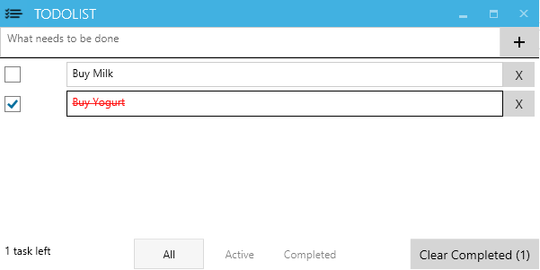

A C# todolist created using MVVM design pattern and bdd priviples 

### Libraries Used
- Mvvm library: [Mvvmlight](http://www.galasoft.ch/mvvm/)
- Specs/TDD: [Nspec](http://nspec.org/)
- Mocking: [Nsubstitute](http://nsubstitute.github.io/)
- Integration Tests: [Specflow](http://www.specflow.org/) and [Microsft CodedUI Framework](http://msdn.microsoft.com/en-us/library/dd286726.aspx)
- UI Components: [MahApps.Metro](http://mahapps.com/MahApps.Metro/)

*Because the project uses CodedUITest, Visual Studio premium and above is required for running the integration tests

### Building the project
- Enable Nuget Restore
- Launch the main app "ToDoWpfView"

### Running the tests:
- Under "Test" -> "Test Settings", choose the file "TestSettings.runsetings"
- Install the visual studio extension "NUnit Test Adapter"
- Under "test" -> "Run", choose "All Tests"

### Sample Spec and Specflow File
- [SpecOutput](sample/spec_output.txt)- [Sample Feature File](/gh-pages/sample/Completing.feature)
- [Sample Spec File](sample/TaskRepository_spec.cs)

### Specs Project: [TodoSpecs](TodoSpecs)
### Integration Test Project: [TodoUiTest](TodoUiTest)